#  Restaurante Gourmet - Full Stack

## Descripción del Proyecto

Aplicación web Full Stack para la gestión del restaurante **Restaurante Gourmet**, desarrollada de la materia Desarrollo Full Stack.

### Características Principales

- ✅ Registro e inicio de sesión de usuarios
- ✅ Autenticación mediante JWT (JSON Web Tokens)
- ✅ Manejo de roles (admin y cliente)
- ✅ Gestión de productos (CRUD parcial)
- ✅ Visualización de menú con imágenes
- ✅ Protección de rutas mediante middleware
- ✅ Pruebas automatizadas con Jest
- ✅ Integración continua con GitHub Actions
- ✅ Despliegue en la nube (Render + Railway)

---

## Arquitectura del Sistema

```
┌─────────────────────────────────────────────────────────────┐
│                        FRONTEND                              │
│   HTML5 + CSS3 + JavaScript (Puro)                         │
│   - index.html (Login)                                      │
│   - register.html (Registro)                                │
│   - dashboard.html (Panel principal)                       │
│   - css/styles.css (Estilos)                                │
│   - js/app.js (Lógica)                                      │
└─────────────────────────────────────────────────────────────┘
                              │
                              ▼
┌─────────────────────────────────────────────────────────────┐
│                         API REST                             │
│   Node.js + Express.js                                      │
│   - /api/auth (Autenticación)                               │
│   - /api/productos (Gestión de productos)                  │
└─────────────────────────────────────────────────────────────┘
                              │
                              ▼
┌─────────────────────────────────────────────────────────────┐
│                      BASE DE DATOS                           │
│   MySQL 8.0 (Railway)                                       │
│   - Tabla: users                                            │
│   - Tabla: productos                                        │
└─────────────────────────────────────────────────────────────┘
```

### Arquitectura General

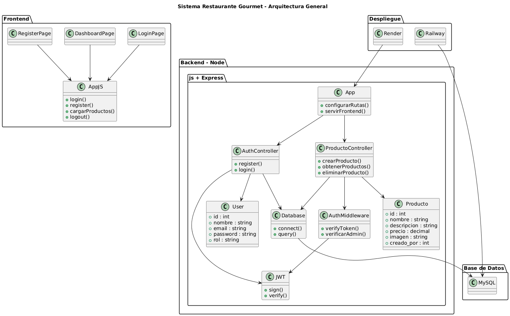
---

## Estructura del Proyecto

```
restaurante-app/
│
├── .github/
│   └── workflows/
│       └── ci.yml              # Pipeline de CI/CD
│
├── backend/
│   ├── config/
│   │   └── db.js               # Configuración de MySQL
│   ├── controllers/
│   │   ├── authController.js  # Controlador de autenticación
│   │   └── productoController.js # Controlador de productos
│   ├── middlewares/
│   │   └── authMiddleware.js   # Middleware de autenticación
│   ├── models/
│   │   └── productoModel.js   # Modelo de productos
│   ├── routes/
│   │   ├── authRoutes.js      # Rutas de autenticación
│   │   └── productoRoutes.js # Rutas de productos
│   ├── tests/
│   │   └── auth.test.js       # Pruebas unitarias
│   ├── app.js                 # Configuración de Express
│   ├── server.js              # Punto de entrada del servidor
│   └── package.json           # Dependencias del backend
│
└── frontend/
    ├── index.html             # Página de login
    ├── register.html          # Página de registro
    ├── dashboard.html        # Panel principal
    ├── css/
    │   └── styles.css         # Estilos CSS
    ├── js/
    │   └── app.js             # Lógica del frontend
    └── images/                # Imágenes de productos
        ├── hamburguesa-clasica.jpg
        ├── pizza-peperoni.jpg
        ├── pasta-alfredo.jpg
        ├── ensalada-cesar.jpg
        └── tacos-pastor.jpg
```

---

## Autenticación y Autorización

### Flujo de JWT

1. El usuario envía credenciales (email y contraseña)
2. El backend valida las credenciales contra MySQL
3. Si son correctas, se genera un token JWT firmado
4. El token se envía al frontend y se almacena en `localStorage`
5. Cada petición protegida incluye el token en el header `Authorization`

### Diagrama de Secuencia

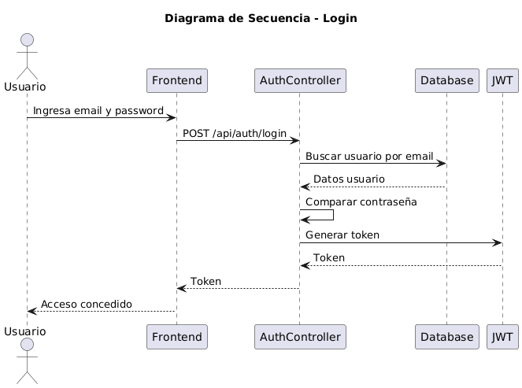

### Roles de Usuario

| Rol | Permisos |
|-----|----------|
| **admin** | Crear productos, eliminar productos, visualizar todo el menú |
| **cliente** | Registrarse, iniciar sesión, visualizar el menú |

### Seguridad Implementada

- 🔒 Contraseñas encriptadas con **bcryptjs**
- 🔑 JWT firmado con clave secreta (variable de entorno)
- 🛡️ Middleware para verificar token
- 🛡️ Middleware para verificar rol de administrador
- 🔒 Variables de entorno en producción

---

## 🗄️ Base de Datos

### Esquema de MySQL

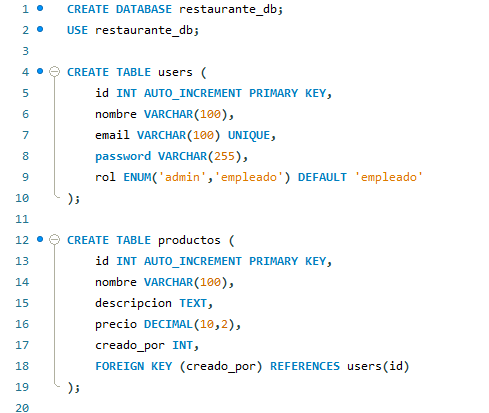
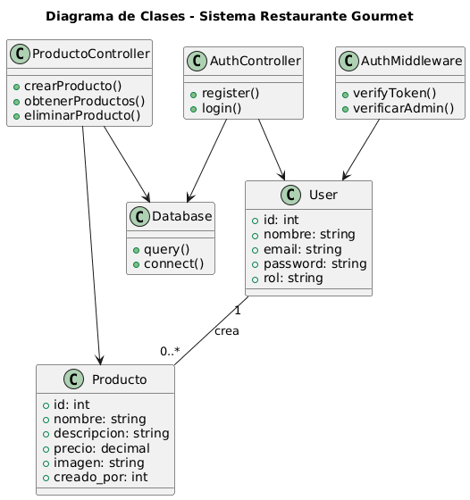

```

> **Nota:** Las tablas se crean automáticamente al iniciar el servidor.

---

## Pruebas Unitarias

Se utiliza **Jest** junto con **Supertest** para probar los endpoints de autenticación.

### Pruebas Incluidas

- ✅ Registro de usuario
- ✅ Inicio de sesión

```bash
# Ejecutar pruebas
npm test
```

### Resultados de Pruebas

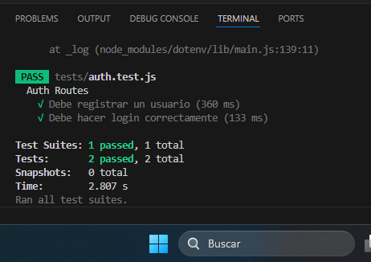

---

## 🔄 CI/CD - Integración Continua

Pipeline configurado con **GitHub Actions** que ejecuta:

1. 🔍 Checkout del código
2. ⚙️ Setup de Node.js 20
3. 📦 Instalación de dependencias
4. 🗄️ Inicialización de MySQL
5. 📋 Creación de tablas de prueba
6. 🧪 Ejecución de pruebas automatizadas

```yaml
# Configuración en .github/workflows/ci.yml
on:
  push:
    branches: [ main ]
  pull_request:
    branches: [ main ]
```

### Pipeline CI/CD

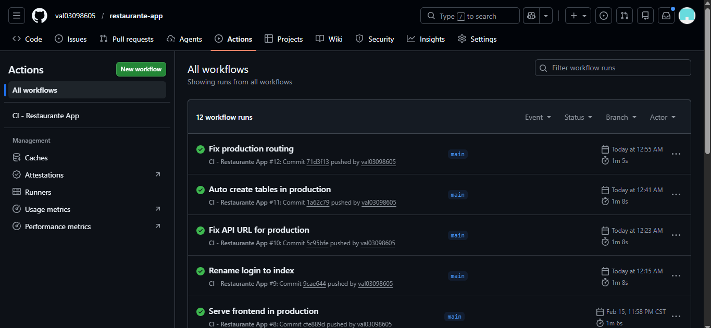

---

## Despliegue en la Nube

### Backend - Render

- **URL:** [https://restaurante-app-and0.onrender.com](https://restaurante-app-and0.onrender.com)
- **Root directory:** `backend`
- **Build command:** `npm install`
- **Start command:** `npm start`


### Base de Datos - Railway

- **Proveedor:** Railway
- **MySQL:** 8.0
- **Puerto:** Dinámico

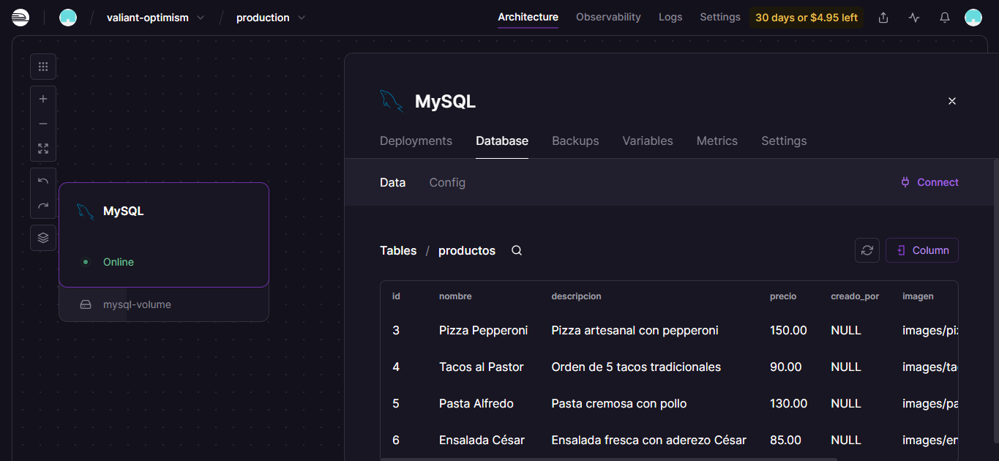

### Configuración SSL

```javascript
ssl: {
    rejectUnauthorized: false
}
```
---

## Endpoints de la API

### Autenticación

| Método | Endpoint | Descripción |
|--------|----------|-------------|
| POST | `/api/auth/register` | Registrar nuevo usuario |
| POST | `/api/auth/login` | Iniciar sesión |

### Productos

| Método | Endpoint | Descripción | Auth |
|--------|----------|-------------|------|
| GET | `/api/productos` | Listar todos los productos | ✅ |
| POST | `/api/productos` | Crear producto | ✅ |
| DELETE | `/api/productos/:id` | Eliminar producto | ✅ (Admin) |

### Pruebas

| Método | Endpoint | Descripción |
|--------|----------|-------------|
| GET | `/api` | Verificar conexión a la API |
| GET | `/api/protegida` | Ruta de prueba protegida |


## Error al no ser administrador
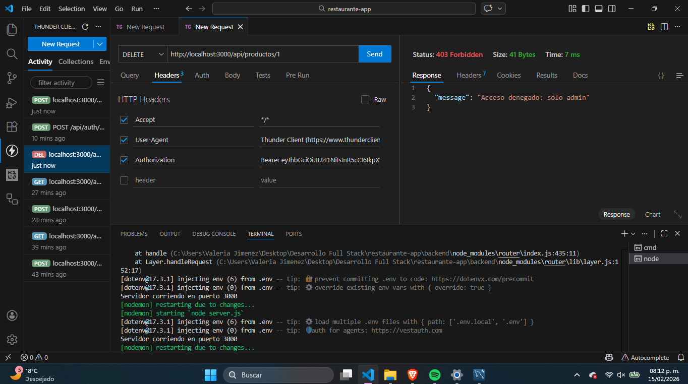

## Registrar usuario
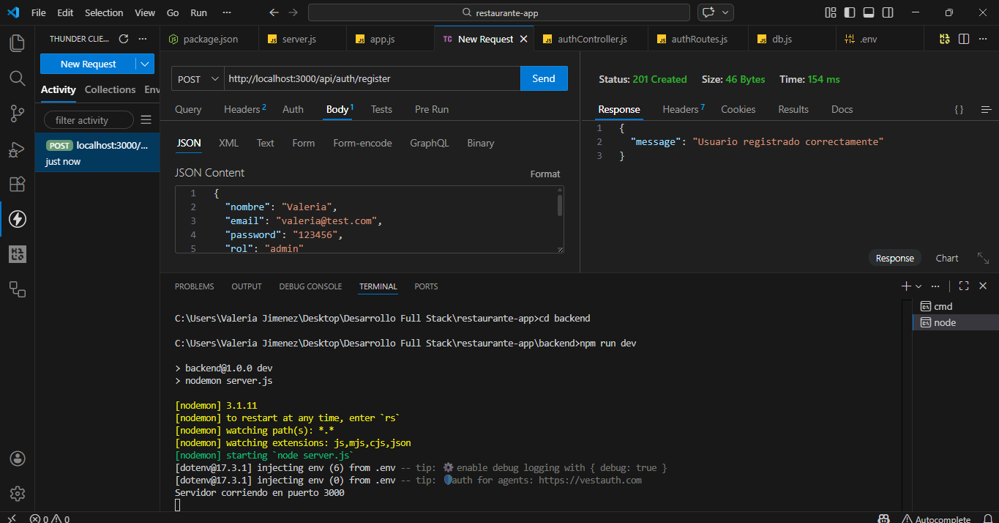

## Crear producto
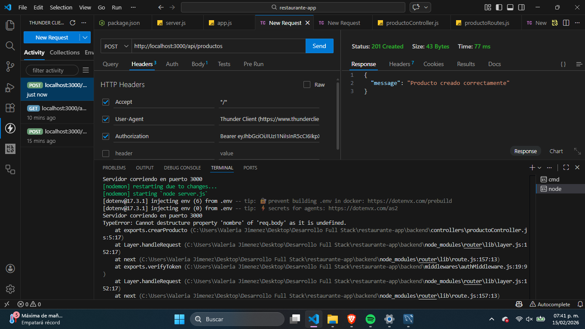

## Eliminar Producto
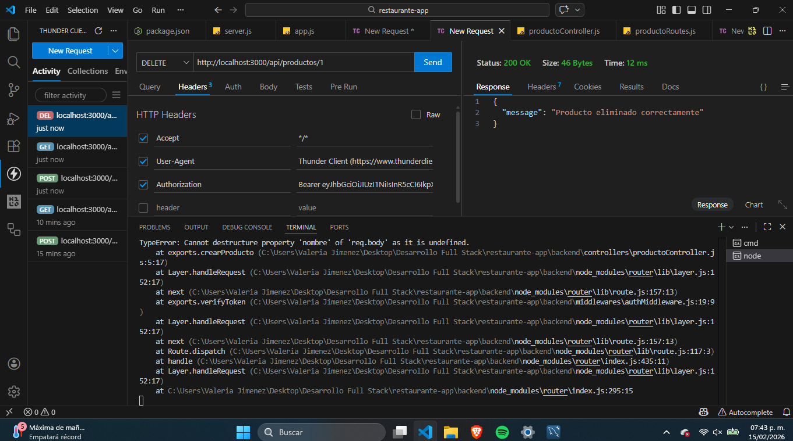

## Proteger ruta
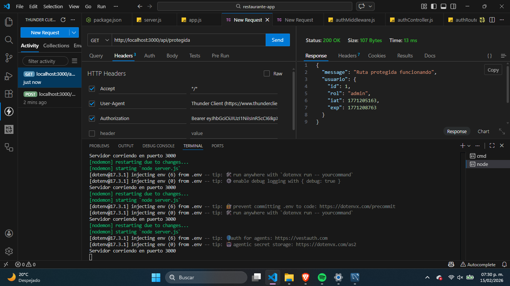

## Crear token para acceso
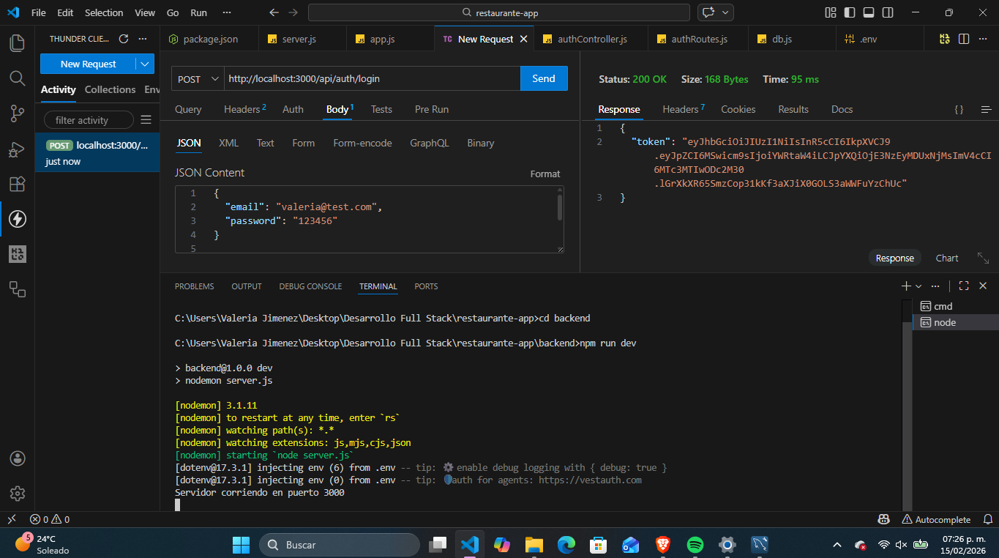

## Pedir token para acceso
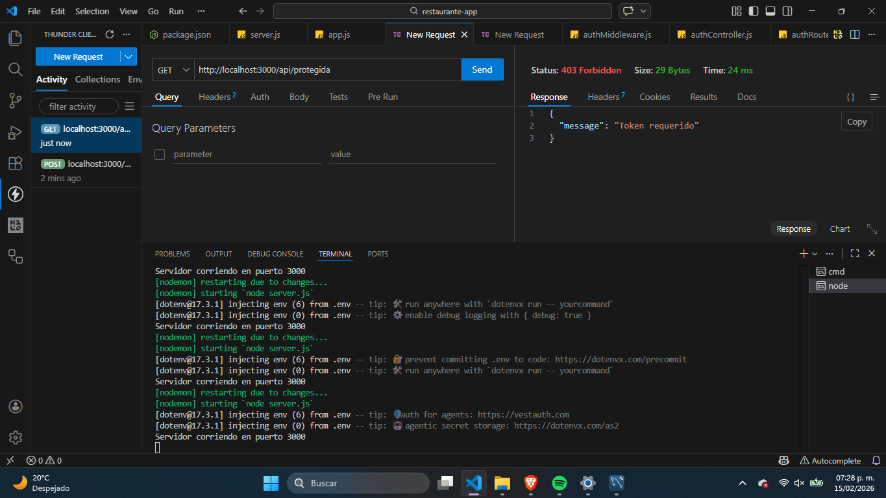

---

## Instalación y Ejecución Local

### Prerrequisitos

- Node.js 20.x
- MySQL 8.0 (o usar la base de datos en la nube)

### Pasos

1. **Clonar el repositorio**
   ```bash
   git clone <repo-url>
   cd restaurante-app
   ```

2. **Instalar dependencias del backend**
   ```bash
   cd backend
   npm install
   ```

3. **Configurar variables de entorno**
   
   Crear archivo `backend/.env`:
   ```env
   PORT=3000
   DB_HOST=localhost
   DB_USER=root
   DB_PASSWORD=tu_password
   DB_NAME=restaurante
   DB_PORT=3306
   JWT_SECRET=tu_secreto
   ```

4. **Iniciar el servidor**
   ```bash
   npm run dev   # Desarrollo (con nodemon)
   npm start     # Producción
   ```

5. **Abrir en navegador**
   ```
   http://localhost:3000
   ```

---

## 🎨 Interfaz de Usuario

### Páginas

1. **index.html** - Login
2. **register.html** - Registro de nuevos usuarios
3. **dashboard.html** - Panel principal con menú

## Página de Login

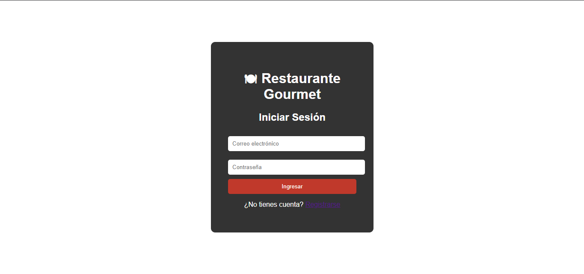

### Página de Registro

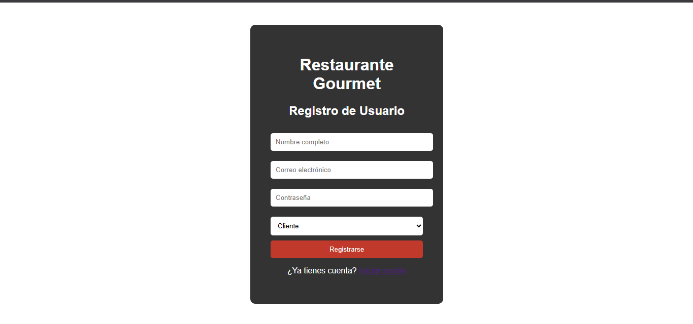


### Vista Admin

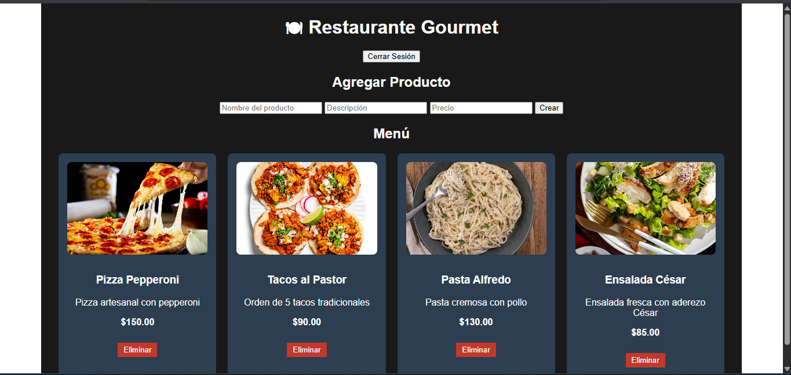

### Vista Cliente

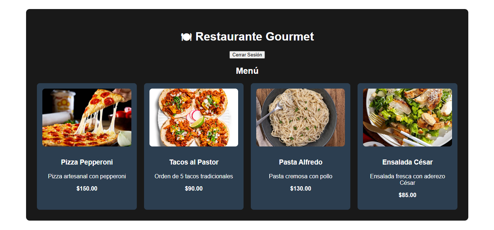

### Funcionalidades del Dashboard

- Visualización de productos en cards
- Sección de administración (solo para admin)
- Crear nuevos productos
- Eliminar productos (solo admin)
- Logout

---

## 🛠️ Tecnologías Utilizadas

### Backend
- **Node.js** - Entorno de ejecución
- **Express.js** - Framework web
- **MySQL2** - Driver de MySQL
- **JSON Web Token (JWT)** - Autenticación
- **Bcryptjs** - Encriptación de contraseñas
- **Dotenv** - Variables de entorno
- **CORS** - Cross-Origin Resource Sharing

### Frontend
- **HTML5** - Estructura
- **CSS3** - Estilos
- **JavaScript (ES6+)** - Lógica
- **Fetch API** - Consumo de API REST

### Herramientas
- **Jest** - Pruebas unitarias
- **Supertest** - Pruebas de API
- **GitHub Actions** - CI/CD
- **Render** - Hosting del backend
- **Railway** - Base de datos en la nube

---

## 📊 Problemas Resueltos

Durante el desarrollo se solucionaron los siguientes desafíos:

- ❌ Error `EADDRINUSE` (puerto en uso)
- ❌ Problemas de conexión MySQL
- ❌ Error `ETIMEDOUT` en Railway
- ❌ SSL obligatorio en producción
- ❌ Error `Cannot GET /`
- ❌ Problemas de rutas en producción
- ❌ Error por localhost en producción
- ❌ CI fallando por variables vacías
- ❌ Problemas de safe update mode en MySQL

---

## Resultado Final

| Característica | Estado |
|----------------|--------|
| Funciona en local | ✅ |
| Funciona en producción | ✅ |
| CI/CD configurado | ✅ |
| Base de datos real | ✅ |
| Autenticación | ✅ |
| Roles (admin/cliente) | ✅ |
| Frontend completo | ✅ |
| Imágenes de productos | ✅ |
| Desplegado públicamente | ✅ |

---

## 📎 Enlaces

- 🔗 **Backend desplegado:** [https://restaurante-app-and0.onrender.com](https://restaurante-app-and0.onrender.com)
- 🔗 **Repositorio GitHub:** https://github.com/val03098605/restaurante-app.git
- 🔗 **Base de datos:** Railway (MySQL)

---

> Este proyecto implementa prácticas reales de desarrollo profesional: separación por capas, autenticación segura, base de datos en la nube, integración continua, deploy automatizado y arquitectura limpia. El sistema está listo para uso real y puede escalarse fácilmente.

## 👩‍💻 Autor

**Valeria Jimenez** - Desarrollo Full Stack
